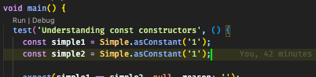

# What is this repository?

This repository contains exercises that new dart and flutter developers can use to learn aspects of the dart language and the dart framework.

# OK, What's next?

Clone the repository.  
Each folder at the root of the project contains a different topic/aspect of the language.  
Most folders will contain a test folder with multiple files named `ex1_...`, `ex2_...` - most time your goal is to make the tests pass.
Open the exercise you're interested in and follow the instructions in the file.

To run a test use one of the following options:
1) VSCode: 
   - Click the run button:  
     
   - Use the keyboard shortcut `cmd+; c` on Mac or `ctrl+; c` everywhere else.
2) From the command line:
   - Navigate to the topic folder.
   - Run `flutter test --plain-name=<test_name>`, for example:  
     `flutter test --plain-name='Understanding const constructors'`

# Contributing

There's an endless amount of topics to cover and more and more are just being added all the time.  
Have a topic you're passionate about - add an exercise or create a new topic folder with new exercises.

